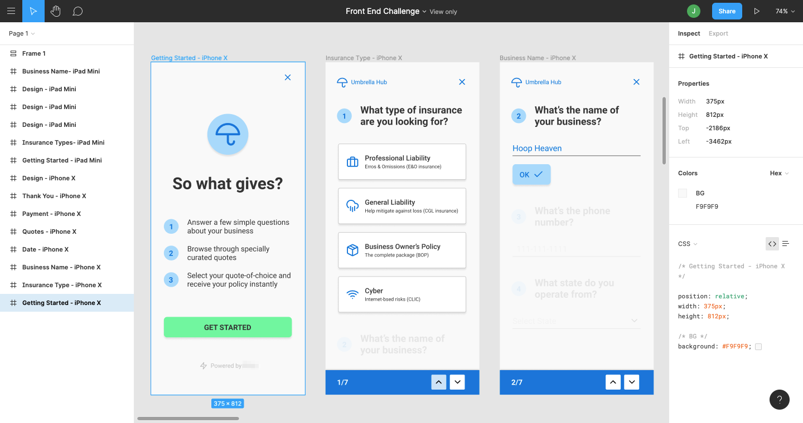

# Challenge
- Atomically designed components in a layout with "pixel-perfect" designs
- A start screen, 2 different pages with inputs
- Write it in a framework of my choosing with 1 breakpoint's designs
- Apply interactions and UX best practices, then deploy it.

# Notes
- The design was for an iphone X but I made sure to provide some coverage for older phones by supporting 320px and a max width of 414px for Androids on the market.
- Tried to roll my own util sass for columns, margin and padding. The outputted CSS is around ~3KB :D 
- Started off creating units of components that fed into molecular composite components, then created layouts that contained different ones.
-  Mentioned work was supposed to be finished in 4-5 hours but in all honesty, it took me that long to set up the type in `_variables.scss`
- I guess if I went with an existing style library that would have made things easier

For the record, I decided not to spend the whole time creating atomic classes for every style but grouped them into reusable mixins.

Known Issues:
- Badge size of numbers are ovalesque on 320px width
- Pagination number matches the routing of survey/:id, however cutting down code through hooks is perhaps a missed opportunity since I haven't figured out how to master `useEffect()`

# Getting Started with Create React App

This project was bootstrapped with [Create React App](https://github.com/facebook/create-react-app).

## Available Scripts

In the project directory, you can run:

### `npm start`

Runs the app in the development mode.\
Open [http://localhost:3000](http://localhost:3000) to view it in the browser.

The page will reload if you make edits.\
You will also see any lint errors in the console.

### `npm test`

Launches the test runner in the interactive watch mode.\
See the section about [running tests](https://facebook.github.io/create-react-app/docs/running-tests) for more information.

### `npm run build`

Builds the app for production to the `build` folder.\
It correctly bundles React in production mode and optimizes the build for the best performance.

The build is minified and the filenames include the hashes.\
Your app is ready to be deployed!

See the section about [deployment](https://facebook.github.io/create-react-app/docs/deployment) for more information.

### `npm run eject`

**Note: this is a one-way operation. Once you `eject`, you can’t go back!**

If you aren’t satisfied with the build tool and configuration choices, you can `eject` at any time. This command will remove the single build dependency from your project.

Instead, it will copy all the configuration files and the transitive dependencies (webpack, Babel, ESLint, etc) right into your project so you have full control over them. All of the commands except `eject` will still work, but they will point to the copied scripts so you can tweak them. At this point you’re on your own.

You don’t have to ever use `eject`. The curated feature set is suitable for small and middle deployments, and you shouldn’t feel obligated to use this feature. However we understand that this tool wouldn’t be useful if you couldn’t customize it when you are ready for it.

## Learn More

You can learn more in the [Create React App documentation](https://facebook.github.io/create-react-app/docs/getting-started).

To learn React, check out the [React documentation](https://reactjs.org/).
